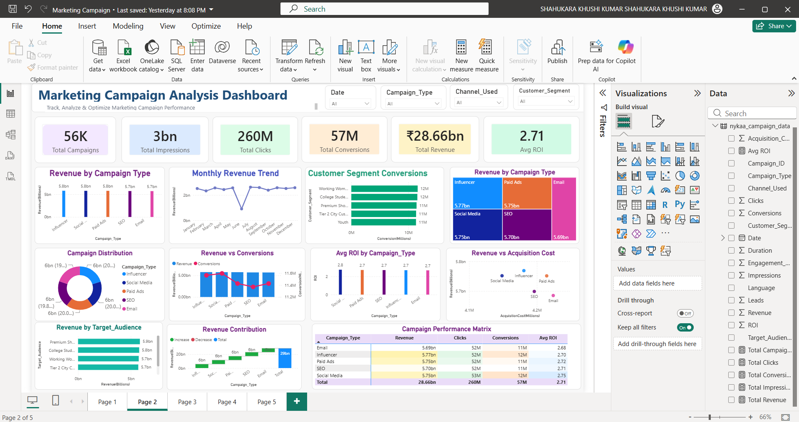

# 📊 Marketing Campaign Analysis Dashboard

Track, Analyze & Optimize Your Marketing Campaign Performance using an interactive Power BI Dashboard.

---

# 📌 1. Project Overview

The **Marketing Campaign Analysis Dashboard** is an interactive Business Intelligence dashboard built using **Microsoft Power BI**. It provides a comprehensive analysis of marketing campaign performance by tracking key metrics such as Revenue, Impressions, Clicks, Conversions, and Return on Investment (ROI).

The dashboard enables business users to monitor campaign effectiveness, compare campaign types, evaluate customer segments, analyze marketing channels, and make informed business decisions through interactive visualizations and slicers.

---

# 🎯 2. Objective

The main objectives of this project are:

- Analyze overall marketing campaign performance.
- Monitor important marketing KPIs.
- Compare campaign types based on revenue and ROI.
- Track monthly revenue trends.
- Analyze customer segment performance.
- Compare acquisition cost with generated revenue.
- Build an interactive dashboard for business users.
- Support data-driven marketing decisions.

---

# 🗂️ 3. Dataset Information

| Column Name | Data Type | Description |
|--------------|-----------|-------------|
| Campaign_ID | Text | Unique campaign identifier |
| Campaign_Type | Text | Type of marketing campaign (Email, Influencer, Paid Ads, SEO, Social Media) |
| Target_Audience | Text | Target customer audience |
| Duration | Whole Number | Campaign duration (Days) |
| Channel_Used | Text | Marketing channel used |
| Impressions | Whole Number | Number of campaign impressions |
| Clicks | Whole Number | Total clicks generated |
| Leads | Whole Number | Number of leads generated |
| Conversions | Whole Number | Number of successful conversions |
| Revenue | Decimal Number | Revenue generated by campaign |
| Acquisition_Cost | Decimal Number | Customer acquisition cost |
| ROI | Decimal Number | Return on Investment |
| Engagement_Score | Decimal Number | Customer engagement score |
| Customer_Segment | Text | Customer segment category |
| Language | Text | Campaign language |
| Date | Date | Campaign execution date |

---

# 📊 4. Dashboard Features

## KPI Cards

- 📌 Total Campaigns
- 👁️ Total Impressions
- 🖱️ Total Clicks
- 🎯 Total Conversions
- 💰 Total Revenue
- 📈 Average ROI

---

## Interactive Slicers

- 📅 Date
- 📢 Campaign Type
- 📱 Channel Used
- 👥 Customer Segment

---

## Dashboard Visualizations

- Revenue by Campaign Type 
- Monthly Revenue Trend 
- Customer Segment Conversions 
- Revenue by Campaign Type 
- Campaign Distribution 
- Revenue vs Conversions 
- Average ROI by Campaign Type 
- Revenue vs Acquisition Cost 
- Revenue by Target Audience 
- Revenue Contribution 
- Campaign Performance Matrix 

---

# 🖼️ 5. Dashboard Preview

# 📈 6. Business Insights

- Social Media campaigns generated the highest revenue.
- Paid Ads also contributed significantly to total revenue.
- Email campaigns delivered competitive ROI despite lower revenue.
- Revenue fluctuated across months, indicating seasonal campaign performance.
- Premium Customers and Working Professionals achieved higher conversions.
- Acquisition cost showed a positive relationship with generated revenue.
- Marketing performance varied across campaign types and customer segments.
- Interactive slicers allow users to analyze campaign performance dynamically.

---

# 💡 7. Business Recommendations

- Increase investment in high-performing campaign types.
- Optimize campaigns with lower ROI.
- Focus marketing efforts on customer segments with higher conversion rates.
- Improve campaign planning during low-performing months.
- Regularly monitor ROI before increasing campaign budgets.
- Use slicers for detailed campaign-specific analysis and strategic decision-making.

---

# 📋 8. Business Requirements

The dashboard should enable users to:

- Monitor campaign performance.
- Analyze campaign revenue.
- Compare campaign types.
- Evaluate customer segments.
- Track monthly trends.
- Analyze acquisition cost.
- Monitor ROI.
- Filter reports using interactive slicers.
- Support business decision-making.

---

# 🛠️ 9. Tools & Technologies

## Visualization Tool

- Microsoft Power BI Desktop

## Data Source

- CSV Dataset

## Data Preparation

- Power Query

## Calculations

- DAX Measures

# ✅ 10. Conclusion

The Marketing Campaign Analysis Dashboard provides an interactive solution for evaluating marketing campaign performance. It combines KPI cards, dynamic visualizations, slicers, and business insights to help users analyze campaign effectiveness, compare marketing strategies, monitor customer engagement, and support data-driven business decisions.

This dashboard demonstrates practical skills in Power BI, data visualization, business intelligence, and marketing analytics.

# 🚀 Key Skills Demonstrated

- Microsoft Power BI
- Power Query
- Data Modeling
- DAX Measures
- Dashboard Design
- KPI Development
- Interactive Slicers
- Marketing Analytics
- Business Intelligence
- Data Visualization
- Business Storytelling
- Data Analysis

---

## 👨‍💻 Author

**Khushikumar Shahukara**

MBA (Business Analytics & Marketing)

LinkedIn: *(Add your LinkedIn profile link here)*
